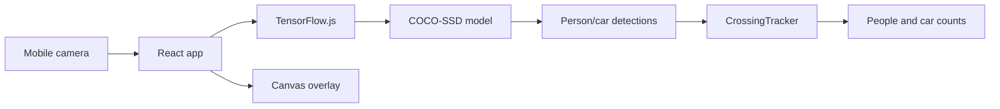

# POCIA Count

POCIA Count is a browser-based prototype that uses TensorFlow.js and COCO-SSD to count people and cars crossing a virtual line from a mobile camera feed.


## Overview

The app opens the device camera, runs object detection directly in the browser, and counts detected people or cars when they cross a configurable horizontal or vertical line.

It is designed as a lightweight proof of concept for browser-based people and vehicle counting without requiring a backend service or external video processing pipeline.

## Features

- Camera capture using `getUserMedia`.
- In-browser object detection with TensorFlow.js and COCO-SSD.
- Detection of `person` and `car` classes.
- Crossing counter for horizontal or vertical lines.
- Live canvas overlay with bounding boxes, confidence labels and counting line.
- Counter reset.
- Responsive UI for mobile camera usage.
- Unit tests for the crossing tracker logic and initial app rendering.
- Static deployment configuration for Netlify.

## Tech Stack

- React 19
- TypeScript
- Vite
- TensorFlow.js
- COCO-SSD
- Vitest
- Testing Library
- Netlify

## Architecture



The detection model runs in the browser. Each frame is analyzed locally, filtered by confidence score, and passed to a small tracking module that detects when an object changes sides across the selected line.

## How Counting Works

1. The app requests access to the device camera.
2. TensorFlow.js loads the COCO-SSD object detection model.
3. Each video frame is analyzed for objects.
4. Only `person` and `car` detections above the confidence threshold are kept.
5. The center of each bounding box is tracked across frames.
6. When a tracked object crosses the selected line, the corresponding counter is incremented.

Current confidence threshold:

```ts
const confidenceThreshold = 0.55;
```

## Getting Started

### Prerequisites

- Node.js 20+
- npm
- A browser with camera support

### Run Locally

```bash
git clone <https://github.com/JulioAmestica/pocia-count.git>
cd pocia-count
npm install
npm run dev
```

Open the local URL printed by Vite, usually:

```text

```

### Build

```bash
npm run build
```

### Preview Production Build

```bash
npm run preview
```

### Run Tests

```bash
npm test
```

The test suite covers the crossing tracker and the initial React render.

## Project Structure

```text
src/
  App.tsx          # Camera access, model loading, detection loop and UI
  tracker.ts      # Crossing-line tracking and counting logic
  tracker.test.ts # Unit tests for counting behavior
  App.test.tsx    # Basic React render tests
  main.css        # Responsive UI styles
netlify.toml      # Static deployment config and camera permissions policy
```

## Privacy

The camera stream is processed locally in the browser. This prototype does not upload video frames to a backend server.

## Accuracy Notes

Accuracy depends on several real-world conditions:

- Camera angle and height.
- Lighting conditions.
- Object distance from the camera.
- Occlusion between people or vehicles.
- Device performance.
- Crowd or traffic density.
- Model confidence threshold.

For production use, the system would need field calibration, benchmark data, error tracking and a more robust multi-object tracking strategy.

## Known Limitations

- Prototype only; not calibrated for production counting.
- Supports `person` and `car` classes only.
- The crossing line is centered and can be horizontal or vertical.
- No backend, persistence or historical reporting.
- Detection performance depends on the user's device.
- Browser camera permissions are required.

## Deployment

The repository includes a `netlify.toml` file for static deployment:

```toml
[build]
  command = "npm run build"
  publish = "dist"
```

The config also includes a camera permissions policy:

```toml
Permissions-Policy = "camera=(self)"
```

## Status

Proof of concept. Core browser-based detection, crossing logic and tests are implemented. Production use would require calibration, analytics, persistence and more robust tracking.

## License

